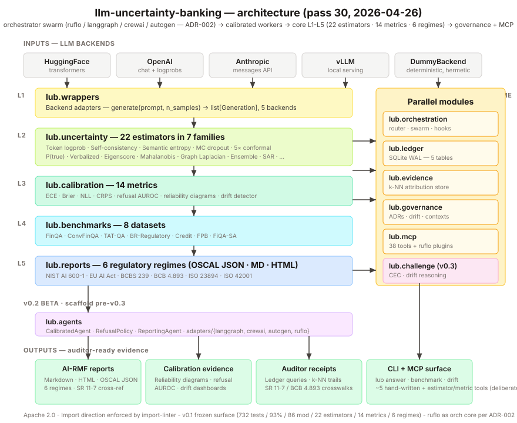
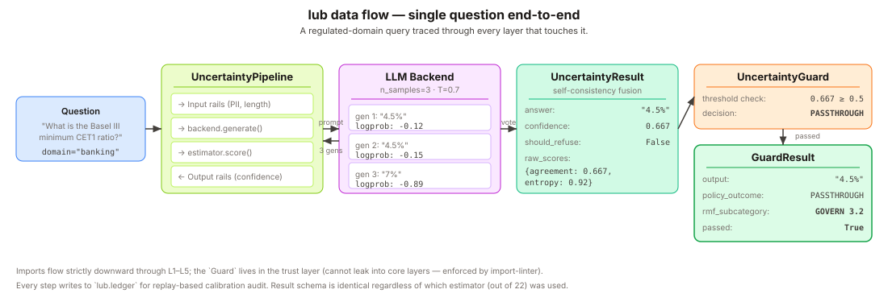

# llm-uncertainty-banking

[](https://opensource.org/licenses/Apache-2.0)
[](https://www.python.org/downloads/)
[](https://github.com/ruvnet/ruflo)

**Turn LLM uncertainty into auditor-ready regulatory evidence.**

*Not just an answer — a governed decision you can defend to an auditor.*
**Governance** — policy-as-code (`lub.governance`) · **Traceability** — every
prompt, score, and decision in a queryable ledger (`lub.ledger`) + OSCAL ·
**Human control** — calibrated refusal thresholds that abstain when the model
isn't sure.

`llm-uncertainty-banking` (import name: `lub`) is an open-source Python library
that combines 22 uncertainty quantification estimators with calibration metrics
and emits machine-readable OSCAL Assessment Results pre-mapped to six regulatory
regimes: NIST AI 600-1 (GenAI Profile of AI RMF 1.0), EU AI Act, BCBS 239,
BCB Res. 4.893/2021, ISO/IEC 23894:2023, and ISO/IEC 42001:2023. SR 11-7
validation pillars are cross-mapped via the three-pillar table below.
Built for the model risk management function at banks, insurers, and
fintechs that must validate LLMs under SR 11-7 "effective challenge"
standards and produce EU AI Act conformity evidence by August 2026.

### First and Only

1. **First OSS library to emit OSCAL Assessment Results for LLM evaluations.**
   Venturalítica SDK (arXiv:2604.13767v1) is the only prior OSCAL-for-AI SDK
   and limits itself to tabular and medical imaging.
2. **First OSS LLM UQ library mapping outputs to SR 11-7 validation pillars
   and NIST AI 600-1 MEASURE 2.3 / 2.7 / 2.9.** ValidMind advertises SR 11-7
   but is closed-source and not LLM-UQ-native.
3. **First OSS library combining conformal prediction for LLMs with calibration
   reporting in a single auditable artifact.** Conformal-for-LLM exists in
   arXiv papers but is not packaged with ECE/Brier/AUROC reporting.

## Use cases

`lub` is the confidence-and-governance layer under an LLM workflow — not the
agent itself. Typical drop-in points:

- **Confidence-gated triage** — auto-handle high-confidence answers; abstain and
  escalate the rest to a human (lead, ticket, or document triage).
- **Auditable decision logging** — every model-assisted decision (credit memo,
  regulatory Q&A, collections note) lands in the ledger with its confidence,
  seed, and regime mapping.
- **Document analysis with abstention** — extract or classify from documents, but
  refuse low-confidence outputs instead of guessing.
- **Compliance evidence on demand** — emit OSCAL Assessment Results for any LLM
  workflow, pre-mapped to six regulatory regimes.

## Why

In banking, an LLM answer is only useful if you know when to trust it. No
existing open-source tool combines LLM-specific uncertainty quantification,
formal calibration metrics, and machine-readable regulatory compliance output
(see [market research](docs/MARKET_RESEARCH.md)). This library brings together:

- **Multiple backends** — HuggingFace, OpenAI, Anthropic, vLLM, plus a
  deterministic `DummyBackend` for tests. Unified `ModelBackend` ABC
  covers both *whitebox* (logprobs + embeddings) and *blackbox*
  (text-only) modes.
- **Uncertainty estimators** — 22 published methods across seven
  families: information-based (token log-probability, perplexity,
  SAR, sentence SAR), diversity-based (self-consistency, semantic
  entropy, EigenScore, ensemble, self-certainty), conformal
  (split conformal, adaptive conformal, Mondrian conformal,
  conformal sampling, CCP), reflexive (p(True)), verbalized
  (one-shot / two-shot self-rating), density-based (Mahalanobis,
  graph Laplacian, epistemic/aleatoric decomposition),
  claim-level, and epistemic (MC dropout). Every estimator cites
  its paper. A separate adapter exposes LM-Polygraph's whitebox
  methods under the same `Estimator` contract; it is not counted
  among the 22 in-house estimators.
- **Calibration metrics** — 14 metrics (ECE, RMSCE, ENCE, Brier,
  refusal AUROC, miscalibration area, sharpness, missing ratio, PRR,
  Spearman, Kendall tau, adversarial group calibration, RPP, MCC),
  5 proper scoring rules (CRPS Gaussian, CRPS from confidence,
  interval score, NLL, pinball loss), 4 normalizers (min-max,
  binned-PCC, isotonic/PAV, quantile; plus an identity no-op),
  UCC/AUUCC curves, risk-coverage curves, and
  reliability diagrams. Plus linguistic calibration scoring. Pure
  numpy — no sklearn, no torch.
- **Regulated-domain benchmarks** — FinQA, ConvFinQA, TAT-QA,
  credit scoring (German Credit, Australian Credit), financial
  sentiment (FPB, FiQA-SA), plus a hand-crafted Brazilian regulatory
  QA set (BCB Resolution 4.658, Basel III) sourced exclusively from
  public `bis.org` and `bcb.gov.br` documents.
- **Multi-regime compliance reports** — markdown / HTML / OSCAL
  reports mapping every metric to the canonical six regulatory
  regimes: NIST AI 600-1 (GenAI Profile of AI RMF 1.0), EU AI Act,
  BCBS 239, BCB Res. 4.893, ISO/IEC 23894, ISO/IEC 42001. SR 11-7
  pillars are cross-mapped via the three-pillar table. OCC 2011-12 /
  SR 11-7 findings triage, OSCAL Component Definitions and
  Assessment Results, JSON-LD provenance, subgroup analysis,
  and reliability diagrams embedded as self-contained base64 PNGs.
- **Governance layer** — `lub.rails` (input/output hook pattern,
  inspired by NeMo Guardrails without the Colang DSL), plus
  `lub.guard` + `lub.policies` (Guardrails-AI-inspired refusal
  policies with structured `GuardResult` records and UALA-gated
  tool calls that feed directly into the AI RMF MANAGE section).
  OTEL-compatible span attributes. No heavy third-party guardrail
  deps.

## Install

Not yet published to PyPI — install from source:

```bash
git clone https://github.com/rafaelmartinsalves/llm-uncertainty-banking
cd llm-uncertainty-banking
uv venv && uv pip install -e ".[dev]"
```

Once released, the published package (future command):

```bash
pip install llm-uncertainty-banking
# or, with optional backends:
pip install "llm-uncertainty-banking[openai,anthropic]"
```

## Quickstart

First run is offline and deterministic — no GPU, no keys, no model download
(the `dummy` backend returns canned generations so you can wire the pipeline in
~2 seconds):

```python
from lub.pipeline import UncertaintyPipeline

pipe = UncertaintyPipeline.from_pretrained(
    model="dummy",
    backend="dummy",
    estimator="self_consistency",
)

result = pipe.answer("What is the Basel III minimum CET1 ratio?")
print(result.answer, result.confidence, result.should_refuse)
```

With a real model — Hugging Face (`backend="hf"`, downloads weights), a local
Ollama or any OpenAI-compatible server (`backend="openai"` +
`OPENAI_BASE_URL=http://localhost:11434/v1`), or hosted OpenAI/Anthropic:

```python
pipe = UncertaintyPipeline.from_pretrained(
    model="Qwen/Qwen2.5-0.5B", backend="hf", estimator="self_consistency"
)
```

CLI:

```bash
lub answer --model dummy --backend dummy \
    --estimator self_consistency "What is the Basel III minimum CET1 ratio?"
lub benchmark --dataset br_regulatory --limit 20 --out results.json
lub report --input results.json --format html --out report.html
```

## Bridge demo console

The optional **Bridge** demonstrator wraps the library into an operable
governance console — the surface a bank's model-risk (MRM) function would use.
It shows a customer query flowing through the guard (PASS / RE-ASK / ESCALATE
when the model isn't sure), a hash-chained audit trail with a live
tamper-detection proof, and a signed, downloadable SR 11-7 evidence package
(plus a 2-page printable leave-behind at `/evidence-report`).

Run it (offline by default — a deterministic FakeBackend, no real LLM or data):

```bash
./bridge-ui/start-demo.sh
# → console at http://localhost:3002
```

- What it is and isn't: [`bridge-ui/README.md`](bridge-ui/README.md) and the
  honest scope doc [`bridge-ui/docs/DEMO_SCOPE.md`](bridge-ui/docs/DEMO_SCOPE.md)
- Security posture (the demonstrator **is** a server): [SECURITY.md](SECURITY.md)
- To run against a real LLM (Ollama): `./bridge-ui/start-real.sh`

## Architecture



Five strict layers (imports flow downward only, enforced by `import-linter`):

```
L5 Reports       AI RMF Jinja template + OSCAL + 6-regime crosswalk
                 findings triage (OCC 2011-12) + JSON-LD provenance
L4 Benchmarks    FinQA · ConvFinQA · TAT-QA · br_regulatory
                 credit_scoring · financial_sentiment + runner
L3 Calibration   14 metrics · 5 scoring rules · 4 normalizers
                 UCC/AUUCC · reliability / risk-coverage plots
                 linguistic calibration · drift detection (PSI/CBPE)
L2 Uncertainty   22 estimators in 7 families (see list above)
L1 Wrappers      ModelBackend ABC + HF / OpenAI / Anthropic / vLLM / Dummy
```

Top-level sibling modules (all optional, all small):

- `lub.pipeline` — `UncertaintyPipeline` façade wiring backend + estimator + rails
- `lub.cli` — Typer CLI (`lub answer | benchmark | report | repro | version`)
- `lub.rails` — input/output hook pattern (NeMo-Guardrails-inspired, no DSL)
- `lub.policies` + `lub.guard` — refusal policies + `GuardResult` wrapper
  (Guardrails-AI-inspired), feeding into the AI RMF MANAGE section

The `lub` library itself ships no web UI, server, or database — library + CLI
only. The optional **`bridge-ui` demonstrator** (FastAPI + Next.js governance
console) wraps it into an operable demo; see the [Bridge demo console](#bridge-demo-console)
section above and [SECURITY.md](SECURITY.md).

### How a single question flows through



A regulated-domain query traced through every layer that touches it: input rails →
backend (n=3 sample) → estimator self-consistency vote → output rails → guard
threshold check → `GuardResult` with `PolicyOutcome` and AI RMF subcategory.

## Governance runtime (Ruflo × LUB)

On top of the five calibration layers, `lub` ships a thin **governance
runtime** that turns the toolkit into an executable spec:

- `lub.orchestration.TieredRouter` — uncertainty-gated cascaded inference
  (Haiku → Sonnet → Opus → abstain), escalation driven by *calibrated*
  confidence, not just price.
- `lub.orchestration.UQSwarm` — run several estimators in parallel and
  fuse them (DAA-style), emitting a `method_disagreement` second-order
  signal useful for routing and human-review triage.
- `lub.orchestration.HookedPipeline` — pre/post hooks around any
  pipeline so the evidence store and ledger stay out of the hot path.
- `lub.ledger.Ledger` — stdlib-sqlite uncertainty ledger (queries,
  answers, UQ scores, policy decisions, outcomes) with
  `replay_calibration()` for nightly reliability-diagram regeneration.
- `lub.evidence.EvidenceStore` — numpy k-NN over hashed TF-IDF for
  retrieval-augmented selective prediction.
- `lub.governance` — bounded contexts + ADRs enforced at runtime via
  `assert_policy`. See `docs/adr/` for the initial three ADRs
  (calibration targets, abstention rules, tier hierarchy).
- `lub.governance.drift` — nightly `enforce_drift(ledger, context)`
  replays reliability buckets from the ledger and raises
  `PolicyViolation` when the measured ECE drifts above the ADR
  target. Wired into `.github/workflows/nightly-calibration.yml` so a
  calibration regression fails CI, not production.
- `lub.ledger.metrics` — stdlib-only Prometheus textfile + Grafana
  SimpleJson export of (n_answers, accuracy, abstain rate, per-tier
  counts, per-method ECE). Drops straight into a
  `node_exporter/textfile_collector/` directory.
- `lub.mcp` — MCP tool surface (`score_with_p_true`,
  `score_with_token_sar`, `reliability_diagram`, `airmf_report`,
  `cascaded_answer`). Install with `pip install 'llm-uncertainty-banking[mcp]'`.

The design is documented in `planning/11_Ruflo_Synthesis.md` and the
implementation plan in `planning/12_Implementation_Prompts.md`.

## SR 11-7 Mapping

Federal Reserve SR 11-7 (OCC 2011-12) is the US supervisory guidance on
model risk management — the de facto standard US banks are examined
against. Every `lub` metric maps to a specific SR 11-7
validation pillar so that a benchmark run produces direct evidence for
each section of a model validation report.

| SR 11-7 Pillar | What it asks | `lub` metrics |
|---|---|---|
| **V.A — Conceptual Soundness** | "Is the model's confidence *meaningful*?" Calibration evidence that predicted probabilities match observed outcomes. | `ece`, `rmsce`, `ence`, `brier`, `miscalibration_area`, `sharpness`, `spearman`, `kendall_tau`, `adversarial_group_calibration` |
| **V.B — Outcome Analysis** | "Does the model *perform*?" Task accuracy and selective-prediction quality — can the model identify its own failures? | `accuracy`, `mcc`, `refusal_auroc`, `prr`, `reversed_pairs_proportion`, `aurc`, `auucc` |
| **VI.A-C — Ongoing Monitoring** | "Is performance *stable* and *auditable*?" Dataset provenance, refusal rates, drift detection, and dependency fingerprinting for change management. | `dataset_hash`, `dataset_version`, `missing_ratio`, `PSI`, `CBPE`, `git_sha`, `package_versions` |

A single `lub benchmark` + `lub report` run populates all three pillars.

> **Deployer / auditor guide:** see [`docs/sr-11-7.md`](docs/sr-11-7.md) for how
> `lub`'s outputs map to each SR 11-7 validation element, the effective-challenge
> scope-limit, and the crosswalk-convention note.

The governance layer (`lub.guard` + `lub.policies`) sits orthogonal to
L1–L4 and cannot be bypassed — mapping directly to SR 11-7's requirement
that model risk controls are independent of model development. The OSCAL
Assessment Results emitted by L5 are machine-ingestible by GRC platforms
(Trestle, RegScale), replacing bespoke Word documents with reproducible,
version-controlled validation evidence.

## Deliberately not adopted from ruflo

Per ADR-002 ruflo (`ruvnet/ruflo`, npm `claude-flow`, MIT) is the
recommended orchestration layer, but several Ruflo features stay
**out of `lub` by design** — not gaps, but conscious divergences
driven by the audit-defensibility requirement that shapes every
other choice in this library:

- **No Q-Learning self-learning router.** `lub.orchestration.TieredRouter`
  uses calibrated UQ thresholds (`P(True)` / token-SAR) that an
  auditor can read off as a fixed decision rule. Learned routing
  without a calibration audit trail is a model-risk problem.
- **Narrower MCP surface** (5 hand-written workflow tools + per-estimator/per-metric
  auto-generators ≈ 43 total) vs Ruflo's 314 auto-generated. Banking
  auditors prefer fewer named tools they can enumerate.
- **No WASM kernels.** `lub.evidence` and `lub.calibration` stay
  numpy + stdlib only — hermetic-test friendly, easy to ship in an
  air-gapped environment.
- **No Byzantine fault tolerance.** `lub.orchestration.UQSwarm` fuses
  scores via weighted vote. BFT is overkill for a single-tenant
  single-org banking deployment.
- **No SPARC dev-workflow agents.** `lub` is a calibration library,
  not a dev orchestrator.

Full rationale for each non-adoption is in
[`docs/architecture.md` § "Deliberately not adopted from ruflo"](docs/architecture.md).
The complete feature gap is enumerated in
`RUFLO_VS_LUB_GAP_2026-04-25.md` (planning tree).

## Status

**Pre-release, demonstrator-grade** — pre-arXiv submission, not yet published to
PyPI. See [SECURITY.md](SECURITY.md) for the evaluator honesty note (no SOC 2,
no independent pen-test, single-tenant demonstrator).

- mypy --strict: 0 type errors; layered imports enforced by `import-linter`
- 22 estimators, 14 metrics, 5 backends, 6 regulatory regimes, 8 datasets
- Protocol-based architecture (lazy imports, no tight coupling)
- Current test counts and coverage: see CI and [TEST_COVERAGE.md](docs/TEST_COVERAGE.md)
- **What is implemented vs. benchmarked on a real model:** [evidence-status.md](docs/evidence-status.md)
  (candor matrix — a non-degenerate real-model accuracy number is still open)

See [CHANGELOG](CHANGELOG.md) and [TEST_COVERAGE.md](docs/TEST_COVERAGE.md). A duplicate copy lives at [`docs/changelog.md`](docs/changelog.md) for the MkDocs site.

## Design notes

> **Architectural repositioning (2026-04-25, ADR-002):** as of pass 24, `lub`
> is best understood as a library of **calibrated workers** that run inside a
> [ruflo](https://github.com/ruvnet/ruflo) swarm (npm `claude-flow`, MIT). The
> recommended entry point is `lub.runtime.build_orchestrated_pack` (alias:
> `build_swarm_pack`); the legacy `lub.pipeline` API is still supported.
> Decision log:
> `planning/ADRs/ADR-002_ruflo_as_orchestration_core_2026-04-25.md`.
>
> **What if ruflo goes away?** `lub` does not `import ruflo` — the bridge is
> the framework-agnostic `OrchestratorAgentProtocol` in
> `src/lub/agents/adapters/orchestrator.py`. Any runtime that satisfies the
> Protocol (langgraph, crewai, autogen, or a future internal orchestrator)
> can substitute for ruflo without touching `lub` core code. See pass-25
> generalization note in ADR-002.

> **Canonical regime set (2026-04-22):** The `Regime` enum in
> `src/lub/reports/crosswalk.py` defines six live regimes — NIST AI 600-1,
> EU AI Act, BCBS 239, BCB Res. 4.893, ISO/IEC 23894, ISO/IEC 42001. All six
> carry real control mappings in `crosswalk_data.toml` (23 metrics × 32
> controls, verified 2026-04-22). NIST AI RMF 1.0 is the umbrella framework
> under which NIST AI 600-1 is the Generative AI Profile; SR 11-7 is mapped
> via the three-pillar table above rather than as a separate `Regime` enum.
> CMN Resolution 4.557/2017 is referenced as the Brazilian prudential
> analogue of SR 11-7 but is not itself a crosswalk regime.

## Contributing

See [CONTRIBUTING.md](CONTRIBUTING.md) and [CODE_OF_CONDUCT.md](CODE_OF_CONDUCT.md).
Security issues: [SECURITY.md](SECURITY.md).

## Citation

If you use this library in academic work, please cite via the
[CITATION.cff](CITATION.cff) file.

## License

Apache License 2.0 — see [LICENSE](LICENSE).
