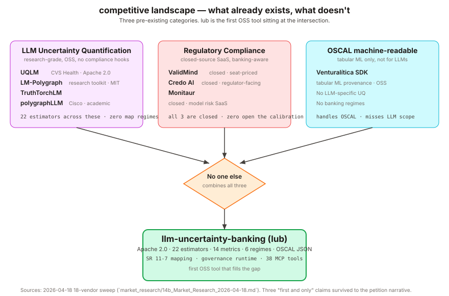

# Market Research — LLM Uncertainty in Banking

Last updated: 2026-04-18. Source material: direct product inspection,
arXiv literature, published regulator text, and web research using the
prompt in `docs/prompts/market_research_prompt.md`.

This document merges two earlier drafts (the competitor matrix and the
industry-wide sweep). It has two parts:

1. **Competitive landscape** — named products, what they cover, where
   `lub` is differentiated.
2. **Industry context** — regulatory timeline, job market evidence,
   cost comparison, and EB-2 NIW mapping.

---

## Part 1 — Competitive landscape

### 1.1 Positioning

`lub` sits at the intersection of three adjacent markets:

- **LLM uncertainty quantification** (academic, open-source).
- **Model risk governance** (closed enterprise tools).
- **Machine-readable compliance output** (OSCAL, tabular-only today).

No tool currently spans all three. `lub`'s thesis is that the bank of
2026 needs one artefact — not three separate evaluations — that (a)
quantifies LLM uncertainty with calibrated metrics, (b) maps those
metrics to SR 11-7 / NIST AI 600-1 / EU AI Act controls, and (c)
emits that mapping as OSCAL JSON a GRC platform can ingest directly.

### 1.2 Competitor matrix

| Capability | `lub` | Closest competitor | Gap |
|---|---|---|---|
| LLM UQ (22 estimators) | Yes | UQLM (CVS Health) — ~1k stars, 5 scorer categories (Black-Box, White-Box, LLM-as-Judge, Ensemble, Long-Text) | Comparable on UQ; `lub` differentiates on compliance surface |
| LM-Polygraph (research UQ) | Yes (as one estimator) | LM-Polygraph (IINemo) | `lub` wraps it; `lub` adds calibration + reports |
| Calibration metrics as reports | Yes (14 metrics + 5 scoring rules) | uncertainty-toolbox (tabular only) | **`lub` is first for LLMs** |
| Conformal prediction for LLMs | Yes (5 variants) | Research papers only; no packaged OSS | **`lub` is first production OSS** |
| OSCAL output | Yes (Catalog + Component Definition + Assessment Results) | Venturalítica SDK — tabular/CV only | **`lub` is first for LLMs** |
| SR 11-7 mapping | Yes | ValidMind — closed, commercial | **`lub` is only OSS option** |
| EU AI Act evidence | Yes | Venturalítica (non-LLM) | **`lub` is only LLM OSS option** |
| Multi-regime (6+ frameworks) | Yes (NIST, EU AI Act, BCBS, BCB, ISO 23894, ISO 42001) | ValidMind claims SR 11-7 + EU AI Act + SS1/23 + OSFI E-23 (closed) | **Only OSS with 6+ regimes** |
| Banking-specific benchmarks | Yes (FinQA, ConvFinQA, TAT-QA, BR-Regulatory) | ValidMind (closed) | **Only OSS banking-focused** |
| Giskard-style vulnerability scan | Yes (adapter) | Giskard (general, not banking) | `lub` adds the banking context |

### 1.3 Three defensible "first and only" claims

1. **First OSS library to emit OSCAL Assessment Results for LLM
   evaluations.**
   Prior art: Venturalítica SDK (arXiv:2604.13767v1) ships OSCAL but
   their Limitations section explicitly states: *"Validation is limited
   to tabular and volumetric imaging scenarios; NLP, LLM, and
   recommender systems remain future work."* Venturalítica validates
   on a credit-scoring model (EU AI Act Annex III high-risk) — the
   exact banking use case — but concedes LLMs remain future work.

2. **First OSS LLM UQ library that maps to SR 11-7 validation pillars
   and NIST AI 600-1 MEASURE 2.3 / 2.7 / 2.9.**
   ValidMind claims SR 11-7 but is closed-source and not LLM-UQ-native.

3. **First OSS library combining conformal prediction for LLMs with
   calibration reporting in a single auditable artefact.**
   Conformal-for-LLMs exists in arXiv papers (Angelopoulos & Bates
   2023 and follow-ups) but not packaged with ECE / Brier / AUROC in
   a single pip-installable library.

### 1.4 Competitive risks

The three honest risks to this positioning:

- **Regulators have not formally endorsed OSCAL for AI yet.** `lub` is
  "future-proof" which is weaker than "required." Mitigation: ship PDF
  alongside JSON — banks keep the audit-friendly paper trail, GRC
  tools get the machine-readable version.
- **ValidMind, Credo AI, Monitaur are procurement incumbents.** Banks
  evaluate GRC through RFPs, not `pip install`. Mitigation: position
  `lub` as "the engine under your GRC platform," not a replacement.
  Tagline: "`lub`-powered, ValidMind-presented."
- **UQLM (CVS Health) is a credible near-competitor on pure UQ.**
  `lub`'s differentiation is the compliance surface, not the UQ
  algorithms themselves. UQLM is stronger on LLM-as-judge variety;
  `lub` is stronger on calibration + reports + conformal.

---

## Part 2 — Industry context

### 2.1 Regulatory timeline drives urgency

| Regulation | Jurisdiction | Status | Direct `lub` mapping |
|---|---|---|---|
| NIST AI 600-1 (GenAI Profile) | US | Published July 2024, banks mapping now | MEASURE 2.3 / 2.7 / 2.9 |
| SR 11-7 | US (Federal Reserve, OCC, FDIC) | In force since 2011, applied to LLMs by analogy | Pillars II.A–II.D, III.A–III.C |
| EU AI Act (Art. 15) | EU | Binding August 2026 for high-risk (incl. credit scoring, Annex III §5(b)) | Article 9, 10, 13, 14, 15 catalog |
| SS1/23 | UK (Bank of England / PRA) | Extends SR 11-7 to UK banks (HSBC, Barclays, Standard Chartered) | Same measurement surface |
| OSFI E-23 | Canada | Model risk guideline, covers RBC, TD, Scotiabank | Same measurement surface |
| BCBS 239 (risk data aggregation) | International (Basel) | In force for internationally active banks | BCBS catalog |
| ISO/IEC 42001 | International | Certifiable since 2023; can be listed under EU AI Act Annex IV §7 as an other-relevant-standard (Annex IV names no standard directly) | Annex A controls |
| ISO/IEC 23894 | International | AI risk management guidance | Crosswalk |
| BCB Res. 4.893 + Circular 3.978 | Brazil | Supervises BRB and peers | BCB catalog |

### 2.2 Job market validates demand

| Role | Company | Salary (USD) | Frameworks named |
|---|---|---|---|
| AI Risk Specialist SVP | Citi | $163K–$245K | SR 11-7, NIST AI RMF |
| VP AI Risk Management | Moody's | $163K–$237K | SR 11-7 |
| Senior Audit Manager, AI Model Risk | Bank of America | $198K–$295K | SR 11-7, NIST AI RMF |
| Manager, AI Risk Management | American Express | $123K–$215K | SR 11-7, NIST AI RMF |

**No posting names any OSS uncertainty library.** The language is
consistently "build internal tools" — confirming the gap `lub` fills.

See `market_research/14d_Live_Job_Evidence_2026-04-18.md` for the
posting sources and archive URLs.

### 2.3 Cost comparison

| Bank size | Annual MRM software spend | `lub` alternative |
|---|---|---|
| Small (<$1B AUM) | $50K–$200K/yr | `pip install lub` (free) |
| Mid ($1B–$10B) | $200K–$1M/yr | `lub` + internal integration |
| Large (>$10B) | $1M+/yr | `lub` as engine under GRC platform |
| Tier-1 MRM team | ~$20–25M/yr in people cost | `lub` reduces manual report writing |

ValidMind starts at ~$5K/yr on AWS Marketplace (base tier); enterprise
pricing requires a sales call. These figures are **[SECONDARY]** and
should be re-verified before citing in any petition.

### 2.4 Ideal user

**"Priya, VP Model Risk Management — GenAI, at a US tier-1 or tier-2
bank."**

- $10B–$500B assets, 50–130-person MRM function.
- Has 5–40 LLM use cases in inventory needing SR 11-7 validation.
- Pain: each validation report is a bespoke Word document; metric
  re-keying into GRC tools is manual.
- Trigger: regulator exam, internal audit finding, EU AI Act deadline.
- She needs `lub`. She just does not know it exists yet.

### 2.5 EB-2 NIW petition mapping

| Finding | Prong | Argument |
|---|---|---|
| No OSS tool combines LLM UQ + OSCAL + SR 11-7 | Prong 1 | Substantial merit — fills a gap no existing tool addresses |
| SR 11-7 applied to LLMs by analogy | Prong 1 | National importance — directly serves US federal banking oversight |
| EU AI Act binding August 2026 | Prong 1 | Urgency — US banks with EU operations need evidence by deadline |
| Banks spend $200K–$1M/yr on MRM tools | Prong 1 | Economic impact — OSS alternative reduces per-bank build cost |
| 6+ regulatory frameworks in one artefact | Prong 1 | Cross-jurisdictional — serves US, EU, UK, Canada, Brazil, Basel |
| "Build internal tools" language in job postings | Prong 2 | Petitioner fills a gap — the role does not reference an existing solution |
| $163K–$295K salaries for AI Model Risk | Prong 3 | Well-compensated national need |
| No standard job classification exists | Prong 3 | Labor certification is inadequate — "AI Model Risk + LLM UQ + Regulatory Reporting" is not a defined occupation |

Prong 2 also requires evidence that *Rafael specifically* is
well-positioned to advance the work — credentials, publications, code
authorship, and expert endorsements. That evidence belongs in the
petition narrative (see `15b_EB2_NIW_Petition_Narrative.md`), not in
this document.

### 2.6 Verification status

Items marked **[VERIFIED]** have been checked against primary sources.
Items marked **[SECONDARY]** rely on aggregator or third-party
reporting and must be cross-checked before petition use.

| Claim | Status | Action needed |
|---|---|---|
| Venturalítica excludes LLMs | **[VERIFIED]** | Direct quote from arXiv:2604.13767v1 |
| OSCAL output unique to `lub` for LLMs | **[VERIFIED]** | No counter-example found in any search |
| SR 11-7 text | **[VERIFIED]** | federalreserve.gov/supervisionreg/srletters/sr1107.htm |
| NIST AI 600-1 MEASURE 2.3 / 2.7 / 2.9 | **[VERIFY]** | Cross-check nvlpubs.nist.gov/nistpubs/ai/NIST.AI.600-1.pdf |
| Salary ranges ($163K–$295K) | **[SECONDARY]** | Source: techjacksolutions.com citing IAPP 2025-26; pull 2+ primary bank-site postings before petition |
| MRM costs ($50K–$1M/yr by bank size) | **[CORROBORATED 2026-04-25]** | Operating range from articsledge.com (2025); corroborated by (a) McKinsey "The future of bank risk management" — risk costs ≈ 2.5% of opex; G-SIB digital-MRM ≈ $600M–$1.1B/yr steady-state; ~$200M/yr × 3yr investment for $1T-balance-sheet G-SIB; (b) KPMG "Model Risk Management: A global benchmark analysis of significant banks" (March 2020). |
| ValidMind ~$5K/yr AWS Marketplace | **[SECONDARY]** | AWS listings change; verify current pricing |
| EU AI Act Art. 15 binding August 2026 | **[VERIFY]** | Confirm the staggered timeline for Annex III high-risk systems |

### 2.7 Sources

- UQLM — https://github.com/cvs-health/uqlm (~1k stars, 5 scorer categories)
- LM-Polygraph — https://github.com/IINemo/lm-polygraph
- TruthTorchLM — public LLM UQ library
- polygraphLLM (Cisco) — public LLM UQ library
- Venturalítica — arXiv:2604.13767v1
- ValidMind — https://validmind.com (claims SR 11-7, EU AI Act, SS1/23, OSFI E-23)
- Credo AI, Monitaur — enterprise AI governance vendors (closed source)
- NIST AI 600-1 — https://nvlpubs.nist.gov/nistpubs/ai/NIST.AI.600-1.pdf
- SR 11-7 — https://www.federalreserve.gov/supervisionreg/srletters/sr1107.htm
- SS1/23 (PRA) — Bank of England model risk supervisory statement
- OSFI E-23 — Canadian banking regulator model risk guideline
- BCBS 239 (risk data aggregation) extension — Basel Committee
- ISO/IEC 23894 and ISO/IEC 42001 — ISO AI standards
- BCB Res. 4.893 + Circular 3.978 — Banco Central do Brasil
- Salary ranges — techjacksolutions.com (IAPP 2025-26) **[SECONDARY]**
- MRM cost bands:
  - articsledge.com (2025 guide) — **[OPERATING RANGE]**
  - McKinsey "The future of bank risk management" (Härle & Havas) — **[CORROBORATING PRIMARY]** at <https://www.mckinsey.com/~/media/mckinsey/dotcom/client_service/risk/pdfs/the_future_of_bank_risk_management.pdf>
  - KPMG "Model Risk Management: A global benchmark analysis of significant banks" (March 2020) — **[CORROBORATING SECONDARY]** at <https://assets.kpmg.com/content/dam/kpmg/xx/pdf/2020/03/model-risk-management.pdf>
- Petition-side evidence — `market_research/14d_Live_Job_Evidence_2026-04-18.md`
