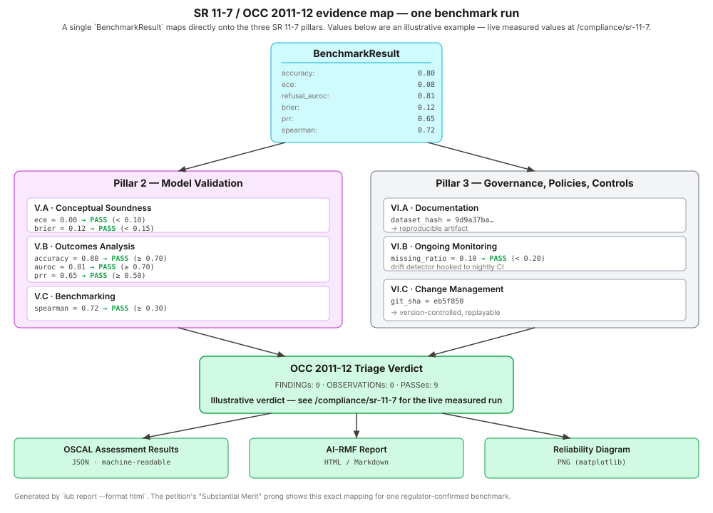

# AI RMF Mapping

Every metric captured by a `BenchmarkResult` is mapped to a NIST AI
Risk Management Framework 1.0 sub-category **and** a coarse
trustworthiness dimension inspired by the
[Holistic AI](https://github.com/holistic-ai/holisticai) taxonomy. The
mapping lives in
[src/lub/reports/mapping.py](https://github.com/rafaelmartinsalves/llm-uncertainty-banking/blob/main/src/lub/reports/mapping.py)
and is surfaced verbatim in the rendered report.

## Metrics table

| Metric                | AI RMF sub-category | Trust dimension | Why it belongs there |
|-----------------------|---------------------|------------------|----------------------|
| `accuracy`            | MEASURE 2.3         | Efficacy         | System performance on the evaluation set. |
| `ece`                 | MEASURE 2.9         | Robustness       | Reliability: how well confidence matches observed correctness. |
| `miscalibration_area` | MEASURE 2.9         | Robustness       | Area between reliability curve and identity diagonal. |
| `sharpness`           | MEASURE 2.9         | Efficacy         | Variance of confidence — how decisive the estimator is. |
| `refusal_auroc`       | MEASURE 2.7         | Robustness       | AUROC of confidence as a refusal gate. |
| `missing_ratio`       | MEASURE 2.7         | Robustness       | Fraction of examples the system refused to answer. |
| `prr`                 | MEASURE 2.7         | Robustness       | Prediction-rejection ratio vs oracle (1.0 = oracle, 0.0 = random). |
| `dataset_hash`        | MEASURE 2.8         | Explainability   | Dataset provenance and reproducibility digest. |
| `dataset_version`     | MEASURE 2.8         | Explainability   | Declared dataset version string — drift diagnosis. |
| `git_sha`             | MANAGE 4.1          | Security         | Code revision under which results were produced. |
| `package_versions`    | MANAGE 4.1          | Security         | Full dependency fingerprint for reproducibility. |

The **Govern** and **Map** sections of the rendered report are
narrative, not metric-driven: they document the intended use, the
operational context, and the change-management posture of the run.

## Why two taxonomies in one table

A single NIST AI RMF sub-category is authoritative for US regulatory
alignment (SR 11-7, EO 14110, OMB M-24-10), but it speaks in the
vocabulary of governance functions (MEASURE, MANAGE, etc.), not in
the vocabulary engineers and model-risk reviewers use in day-to-day
conversation. The trustworthiness dimension column gives the same
row a second, more colloquial label (*"this is a robustness
concern"* vs *"this is an efficacy concern"*) without introducing a
new sub-category system. It is a convenience, not a second
authority.

## Customizing the mapping

You can override or extend the mapping at render time by passing a
custom dict into your own template. The template reads a single `rmf`
variable, so a fork that adds more metrics only needs to update
`mapping.py` and the `## Measure` table row in the template — the
renderer itself is generic.

## What the mapping is not

It is not a certification. An AI RMF mapping is evidence, not a
pass/fail stamp — a reviewer has to decide whether the numbers meet an
institutionally set tolerance. Use the report as the input to a
model-risk committee, not as its verdict.
