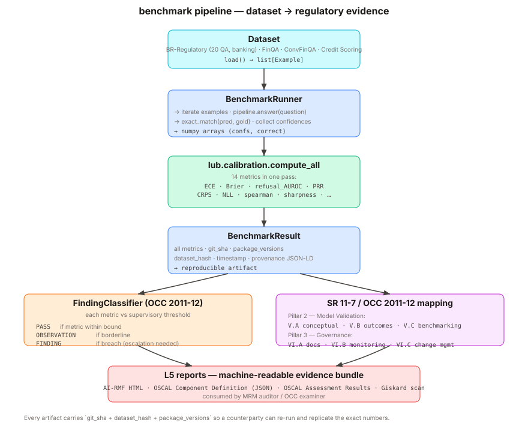

# Benchmarks



Datasets in `lub.benchmarks` share a single `Example` schema and a
`Dataset` ABC, so that the benchmark runner is dataset-agnostic and
every persisted `BenchmarkResult` carries a reproducible
`dataset_hash`.

## Built-in datasets

| Name              | Class                        | Source                             |
|-------------------|------------------------------|------------------------------------|
| `finqa`           | `FinQADataset`               | HuggingFace `datasets`             |
| `convfinqa`       | `ConvFinQADataset`           | HuggingFace `datasets` or local    |
| `tatqa`           | `TATQADataset`               | HuggingFace `datasets` or local    |
| `br_regulatory`   | `BrazilianRegulatoryDataset` | Packaged JSONL (20 examples)       |

See [data/README.md](https://github.com/rafaelmartinsalves/llm-uncertainty-banking/blob/main/src/lub/benchmarks/data/README.md)
for the full provenance of the Brazilian regulatory set.

## Running a benchmark

```python
from lub.benchmarks import BenchmarkRunner, BrazilianRegulatoryDataset
from lub.pipeline import UncertaintyPipeline

pipe = UncertaintyPipeline.from_pretrained(
    model="dummy-model", backend="dummy", estimator="self_consistency"
)
runner = BenchmarkRunner(pipeline=pipe, dataset=BrazilianRegulatoryDataset())
result = runner.run(limit=20, seed=0)
```

`BenchmarkRunner.run()` returns a `BenchmarkResult` Pydantic record that
includes the dataset hash, git SHA, Python version, and full package
version dict — enough metadata for a reviewer to reproduce the run.

## Adding a new dataset

1. Create `src/lub/benchmarks/mydataset.py`.
2. Subclass `Dataset`, implement `name`, `version`, and `load()`.
3. Yield `Example(id, question, gold_answer, metadata)` records.
4. Export from `src/lub/benchmarks/__init__.py`.
5. Add a test in `tests/test_benchmarks.py` asserting stable `hash()`
   and a reasonable example count.

The runner and report layer will pick it up automatically — there is no
registry to maintain.

## First real-model run (2026-07-11) — honest, and degenerate

The only result that had ever been committed was a `DummyBackend` null. This is
the first end-to-end run against a **real local LLM** (planning/33 P1 / planning/39).

- **Model:** `llama3.1:8b` via Ollama, reached through the `openai` backend with
  `OPENAI_BASE_URL=http://localhost:11434/v1` (see `wrappers/openai.py`).
- **Dataset:** `br_regulatory`, n=20 (full). **Estimator:** `self_consistency`. Seed 0.
- **Provenance:** `git_sha 4ecdcff`, `dataset_hash 9d9a37ba…`, 0 errors, ~33 min.

**Result — degenerate (reported as-is, not massaged):**

| metric | value |
|---|---|
| accuracy | **0.0** |
| refusal_auroc | 0.5 |
| ece | 0.10 |

Every one of the 20 items came back `should_refuse=True` with confidence floored
at exactly 0.10. This is **not** "the model is 0% accurate" — it is the guard
**refusing everything**: `self_consistency` scores agreement across sampled
answers, and on open-ended regulatory questions each free-text sample is a
distinct string, so (without answer normalization/extraction) agreement collapses
to ~0, confidence hits the floor, and the guard withholds every answer.

Two things caused the degeneracy: (1) `self_consistency` floors confidence on
open-ended free-text (no answer normalization → every sample is a distinct
string → agreement ~0 → refuse all), and (2) the default `exact_match` scorer
marks a verbose answer ("…the minimum CET1 ratio is 4.5%…") wrong even though it
contains the gold value "4.5%".

## Resolved run (2026-07-11) — the first non-degenerate real number

Swapping to the **`perplexity`** estimator (scores the single answer's own token
logprobs, which Ollama returns — no cross-sample clustering) and **`fuzzy_match`**
correctness (extractive containment — the honest scorer for short-answer QA) on
the same `llama3.1:8b`, br_regulatory n=20:

| metric | value |
|---|---|
| accuracy | **0.55** |
| refusal_auroc | 0.586 |
| ece | 0.178 |

This **meets planning/33 P1** (accuracy > 0; refusal_auroc defined). It is a real
local-LLM result: `llama3.1:8b` answers ~55% of these regulatory questions with
the correct value, and confidence carries some (0.586-AUROC) signal for when to
refuse. The library is now **demonstrated**, not just claimed. Reproduce (the CLI
does not yet expose a correctness override, so use the committed script):

```bash
# Ollama running with llama3.1:8b pulled
python scripts/run_real_benchmark.py --model llama3.1:8b --limit 20
```

Open items (planning/36): `self_consistency` answer-normalization (RC-D), and
CLI/dataset selection of the correctness scorer so this is a one-flag `lub
benchmark` run.
