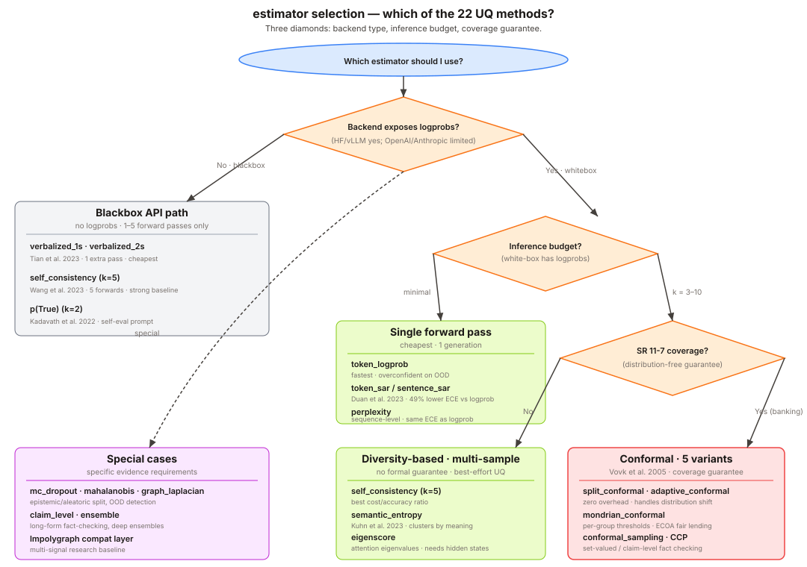

# Estimators



Every estimator subclasses `lub.uncertainty.base.Estimator` and returns
an `UncertaintyResult`. All estimators take a `ModelBackend` and a
prompt; configuration lives on the estimator instance.

## Whitebox vs blackbox

The literature (Fadeeva et al. 2023, Lin et al. 2023, LM-Polygraph) splits
backends into **whitebox** (per-token log-probabilities + embeddings
available) and **blackbox** (text-only). LUB's `ModelBackend` unifies both:
a backend that only implements `generate()` is blackbox; one that also
implements `logprobs()` and `embed()` is whitebox. The table below
tags each estimator with the weakest backend it works on.

| Estimator | Works on | Family |
|---|---|---|
| `TokenLogprobEstimator` | whitebox | information |
| `PerplexityEstimator` | whitebox | information |
| `TokenSAREstimator` | whitebox | information |
| `SentenceSAREstimator` | whitebox | information |
| `PTrueEstimator` | whitebox → blackbox fallback | reflexive |
| `SelfConsistencyEstimator` | blackbox | diversity |
| `SemanticEntropyEstimator` | blackbox | diversity |
| `EigenScoreEstimator` | whitebox (needs `embed`) | diversity |
| `SelfCertaintyEstimator` | whitebox | diversity |
| `MahalanobisEstimator` | whitebox (needs `embed`) | density |
| `GraphLaplacianEstimator` | whitebox (needs `embed`) | density |
| `EpistemicAleatoricEstimator` | whitebox | density |
| `MCDropoutEstimator` | HF whitebox only | density (epistemic) |
| `VerbalizedOneShot` / `VerbalizedTwoShot` | blackbox | verbalized |
| `ConformalEstimator` | whitebox | calibration |
| `AdaptiveConformalEstimator` | whitebox | calibration |
| `MondrianConformalEstimator` | whitebox | calibration |
| `ConformalSamplingEstimator` | whitebox | calibration |
| `CCPEstimator` | blackbox | fact-level |
| `ClaimLevelEstimator` | blackbox | fact-level |
| `EnsembleEstimator` | depends on sub-estimators | composite |
| `LMPolygraphEstimator` | whitebox (HF) | bridge |

> **Counting note.** This table has 22 rows because `VerbalizedOneShot` /
> `VerbalizedTwoShot` share one row (they live in the same module and are
> reported as a single method with two prompting variants). The
> `lub.uncertainty.base` registry exposes 23 keys for the same reason —
> the two verbalized variants register separately. Both numbers are
> defensible; the petition narrative and `planning/CANONICAL_FACTS.md`
> use 22 (method count). See the "7-vs-8 family note" in
> `CANONICAL_FACTS.md` for the parallel decision on family count;
> `MCDropoutEstimator` is folded under *density (epistemic)* there for
> the same reason.

## Token log-probability

Single-generation baseline. Confidence is the geometric mean of per-token
probabilities: `exp(mean(logprobs))`.

```python
from lub.uncertainty import TokenLogprobEstimator
from lub.wrappers import DummyBackend

est = TokenLogprobEstimator(refusal_threshold=0.5)
result = est.score(DummyBackend(), "What is CET1?")
```

Cheap and single-pass; miscalibrated on open-ended generation.

## Perplexity

Fomicheva et al. 2020. Same input as token-logprob but reports both
`perplexity = exp(-mean_logprob)` and `confidence = exp(mean_logprob)`
in `raw_scores`. Use this when you want the perplexity number in the
diagnostic trail (most papers report it) without writing your own
helper.

```python
from lub.uncertainty import PerplexityEstimator

est = PerplexityEstimator(refusal_threshold=0.5)
```

## p(True) — reflexive

Kadavath et al. 2022, *Language Models (Mostly) Know What They Know.*
The model is asked to evaluate its own answer: *"Is the proposed
answer correct? True/False."* Confidence is the softmax over `True`
vs `False` logprobs (whitebox path) or the majority vote fraction
over sampled judge responses (blackbox fallback).

```python
from lub.uncertainty import PTrueEstimator

est = PTrueEstimator(n_blackbox_samples=5, temperature=0.7)
```

Two model calls per question (answer + judge), no calibration set, no
NLI dependency. Good on short-answer QA where the model has internal
knowledge of whether it got the answer right.

## EigenScore — no-NLI diversity

Lin et al. 2023, *Generating with Confidence.* Samples `n` generations,
embeds them, and computes the spectrum of the centered Gram matrix of
those embeddings. Confidence is derived from the eigenvalue
concentration: tight clustering → high confidence, spread-out → low.

```python
from lub.uncertainty import EigenScoreEstimator

est = EigenScoreEstimator(n_samples=10)
```

Unlike semantic entropy, EigenScore needs only `backend.embed()`, not
an NLI model. This is the preferred diversity-based estimator when
`sentence-transformers` is not installed.

## Self-consistency

Wang et al. 2022, *Self-Consistency Improves Chain of Thought Reasoning
in Language Models*. Samples `n` generations at non-zero temperature,
normalizes answers (lowercase + strip), and takes the majority vote.
Confidence is the fraction of samples agreeing with the majority answer.

```python
from lub.uncertainty import SelfConsistencyEstimator

est = SelfConsistencyEstimator(n_samples=10, temperature=0.7)
```

Model-agnostic, strong on short-answer QA.

## Semantic entropy

Kuhn et al. 2023, *Semantic Uncertainty: Linguistic Invariances for
Uncertainty Estimation in Natural Language Generation*. Samples are
clustered by bidirectional NLI entailment, cluster probabilities are
estimated from length-normalized joint log-likelihood, and the
entropy over clusters is mapped to a confidence in `[0, 1]`.

```python
from lub.uncertainty import SemanticEntropyEstimator

est = SemanticEntropyEstimator(n_samples=10)
```

Requires `sentence-transformers` (install the `nli` extra). Falls back
to string-equality clustering if the NLI model is unavailable.

## Split conformal prediction

Vovk et al. 2005, *Algorithmic Learning in a Random World*. Fit
nonconformity scores on a held-out calibration set, then refuse at
inference when a new prompt's nonconformity exceeds the
`(1 - alpha)` empirical quantile.

```python
from lub.uncertainty import ConformalEstimator
from lub.wrappers import DummyBackend

backend = DummyBackend()
est = ConformalEstimator(alpha=0.1)
est.fit(
    [("What is CET1?", "4.5%"), ("What is LCR?", "100%")],
    backend=backend,
)
result = est.score(backend, "What is NSFR?")
```

Under exchangeability, this gives a marginal coverage guarantee of at
least `1 - alpha` on the kept answers.

## Monte Carlo dropout

Gal & Ghahramani 2016, *Dropout as a Bayesian Approximation*. Runs
multiple forward passes with dropout enabled at inference, separates
predictive from expected entropy, and uses the mutual information as an
epistemic-uncertainty proxy. Only supported on `HFBackend`.

## TokenSAR — relevance-weighted logprob

Duan et al. 2023, *Shifting Attention to Relevance*. Same cost as
`TokenLogprobEstimator` (one generation, whitebox) but weights each
token's log-probability by its relevance `r_i = -logp_i`. High-surprise
tokens dominate the uncertainty signal — the few critical tokens that
determine answer correctness — while confident boilerplate is
down-weighted.

```python
from lub.uncertainty import TokenSAREstimator

est = TokenSAREstimator(refusal_threshold=0.5)
```

Drop-in replacement for `TokenLogprobEstimator` on selective-prediction
tasks; consistently outperforms unweighted mean logprob in the paper.

## Mahalanobis — density-based

Ren et al. 2023, *Out-of-Distribution Detection and Selective Generation
for Conditional Language Models*. Generates `n` samples, embeds them,
and computes the mean Mahalanobis distance from the sample centroid
using a regularized sample covariance. Unlike EigenScore (spectral
diversity of the Gram matrix), Mahalanobis accounts for covariance
structure so correlated embedding dimensions don't inflate the signal.

```python
from lub.uncertainty import MahalanobisEstimator

est = MahalanobisEstimator(n_samples=10, reg=1e-6)
```

Requires `backend.embed()`. Raises `TypeError` with an actionable
message on backends without embedding support.

## Verbalized confidence — blackbox-friendly

Tian et al. 2023 + Lin et al. 2022. The model is prompted to rate its
own confidence on a 0–100 scale. Two variants:

- `VerbalizedOneShot`: single call producing `ANSWER: / CONFIDENCE:`
  in a fixed layout. Cheapest blackbox option.
- `VerbalizedTwoShot`: two calls — answer first, then rate. More
  expensive but avoids the answer being biased by the rating request.

```python
from lub.uncertainty import VerbalizedOneShot, VerbalizedTwoShot

cheap = VerbalizedOneShot()
clean = VerbalizedTwoShot()
```

The only estimators (besides self-consistency) that work on hosted APIs
without logprob access. Self-ratings are systematically over-confident
on hard questions; treat as a diagnostic signal, not a substitute for
sampling-based methods.

## Conformal sampling — dual admission/rejection

Quach et al. 2024, *Conformal Language Modeling*, ICLR. Extends split
conformal to a sampling-based setting: generates `k` candidate
completions, applies the calibrated admission threshold to each, and
rejects the prompt if fewer than `min_admit` samples are admitted.
Admitted set carries the `(1 - alpha)` marginal coverage guarantee;
rejection rule catches prompts the model is broadly uncertain on.

```python
from lub.uncertainty import ConformalSamplingEstimator

est = ConformalSamplingEstimator(alpha=0.1, n_samples=10, min_admit_fraction=0.3)
est.fit([(prompt, gold), ...], backend=backend)
result = est.score(backend, "What is NSFR?")
```

Confidence is the admission rate. Use this when the standard single-
generation conformal is too brittle — the sampling approach is more
robust on open-ended QA.

## CCP — claim-conditioned probability

Fadeeva et al. 2024, *Fact-Checking the Output of Large Language Models
via Token-Level Uncertainty Quantification*, ACL Findings. Decomposes
the answer into atomic factual claims via a second LLM call, then
verifies each claim ("Supported / Unsupported") via a third. Confidence
is the fraction of supported claims.

```python
from lub.uncertainty import CCPEstimator

est = CCPEstimator(max_claims=10, refusal_threshold=0.5)
```

Fully blackbox and the only LUB estimator that operates at the **fact
level** rather than the answer level. Banking-critical: one wrong
number in an otherwise correct narrative is a material error that
sequence-level estimators average away.

## Ensemble — weighted blend

Inspired by CVS Health's UQLM, arXiv:2507.06196 (2025). Runs `k`
sub-estimators and returns a weighted average of their confidences.
The answer is taken from the most-confident sub-estimator.

```python
from lub.uncertainty import (
    EnsembleEstimator,
    TokenLogprobEstimator,
    PerplexityEstimator,
    VerbalizedOneShot,
)

est = EnsembleEstimator(
    estimators=[TokenLogprobEstimator(), PerplexityEstimator(), VerbalizedOneShot()],
    weights=[0.5, 0.3, 0.2],  # optional; defaults to equal weights
)
```

Accepts custom weight vectors for calibrated blending after a dev-split
sweep. Weights must be non-negative and are normalized to sum to 1.

## LM-Polygraph bridge

Fadeeva et al. 2023. Thin wrapper around the `lm-polygraph` package
that exposes LM-Polygraph's estimator suite through LUB's `Estimator`
interface. Optional dependency — install via the `lmpolygraph` extra.

```python
from lub.uncertainty import LMPolygraphEstimator

est = LMPolygraphEstimator(estimator_name="MaximumSequenceProbability")
```

Use this to access estimators that LUB has not natively ported, without
leaving the LUB pipeline/report toolchain.
