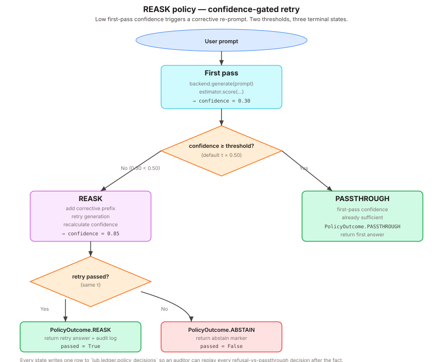

# Governance Layer



Uncertainty is only half of a regulated-banking story. The other half
is **what you do about it** — the policy decisions, refusal gates,
and input/output checks that sit around the estimator and decide
whether an answer ever reaches a user. LUB ships three small,
opt-in modules for that: `rails`, `policies`, and `guard`.

All three are deliberately *thin*. LUB does not ship a Colang DSL,
an async flow engine, or a jailbreak-detection model. If you need
those, reach for [NeMo Guardrails](https://github.com/NVIDIA/NeMo-Guardrails)
(NVIDIA, Apache-2.0) or [Guardrails AI](https://github.com/guardrails-ai/guardrails)
directly. What LUB adds is the minimal surface that ties
uncertainty-gated behavior to the same AI RMF reporter that owns the
rest of the metric stack.

## `lub.rails` — input/output hook layer

Inspired by the **rails** concept in NeMo Guardrails, minus the DSL.
A :py:class:`~lub.rails.RailSet` is two lists of plain Python
callables that `UncertaintyPipeline` applies in order: input rails
transform or reject the prompt before generation, output rails
transform or reject the :py:class:`~lub.types.UncertaintyResult` after
generation.

```python
from lub.pipeline import UncertaintyPipeline
from lub.rails import (
    RailSet,
    max_length,
    reject_pii,
    require_confidence,
    strip_chain_of_thought,
)

pipe = UncertaintyPipeline.from_pretrained(
    model="dummy-model",
    backend="dummy",
    estimator="self_consistency",
    n_samples=8,
    rails=RailSet(
        input_rails=[max_length(2000), reject_pii()],
        output_rails=[
            require_confidence(0.4),
            strip_chain_of_thought(),
        ],
    ),
)
result = pipe.answer("What is the Basel III CET1 ratio?")
```

### Built-in rails

| Function                        | Kind   | Effect |
|---------------------------------|--------|--------|
| `max_length(limit)`             | input  | Raise `InputRailRejected` if prompt exceeds `limit` characters. |
| `reject_pii(categories=None)`   | input  | Raise `InputRailRejected` on email / US SSN / Brazilian CPF / card-like digit runs. |
| `strip_whitespace()`            | input  | Trim leading/trailing whitespace. |
| `require_confidence(min)`       | output | Raise `OutputRailRejected` if `confidence < min`. |
| `strip_chain_of_thought(marker)`| output | Drop any trailing chain-of-thought after `marker`. |
| `force_refuse_below(threshold)` | output | Non-raising alternative: set `should_refuse=True` below threshold. |

`reject_pii` is a **heuristic**, not a replacement for Presidio or a
real DLP product. It catches the obvious cases and is fast; anything
more sophisticated should sit behind a custom input rail calling a
production scanner.

## `lub.policies` — refusal policy primitives

`lub.policies` defines the small vocabulary of actions a guard can
take when an answer's confidence falls below threshold. Each action
is a stable string (`PolicyDecision`) so it survives JSON round-trips
without custom serializers, and each action maps to a specific NIST
AI RMF **MANAGE** sub-category so the reporter can aggregate
per-prompt decisions into a MANAGE-section *"actions taken"* table.

The shape is inspired by
[Guardrails AI](https://github.com/guardrails-ai/guardrails)'s
`on_fail` parameter (Apache-2.0), but scoped narrowly to uncertainty
gating rather than general input/output validation.

## `lub.guard` — `GuardResult` wrapper

`lub.guard.Guard` is a thin adapter over `UncertaintyPipeline` that
returns a :py:class:`~lub.guard.GuardResult` per prompt instead of a
bare `UncertaintyResult`. A `GuardResult` carries:

- `raw` — the underlying `UncertaintyResult`, untouched
- `outcome` — a `PolicyOutcome` describing what the guard decided
  and which `PolicyDecision` drove it
- `output` — the final text the guard is willing to surface, or an
  abstain marker

This is the shape the AI RMF report's MANAGE section expects when
you aggregate per-prompt outcomes into a run-level *"actions taken"*
summary.

## Choosing between the three

- **Just want to reject bad prompts and too-uncertain answers inside
  the pipeline?** Use `rails`. It is the smallest surface, and it
  composes cleanly with any estimator.
- **Want structured, reportable per-prompt decisions that feed into
  the MANAGE section of the AI RMF report?** Use `guard` + `policies`.
  They are designed for the model-risk audit trail.
- **Both.** The pipeline's `rails=` argument and `Guard` are not
  mutually exclusive — rails run inside the pipeline, the guard runs
  around it. A typical production setup stacks them.

## What these modules explicitly do NOT do

- No jailbreak detection, content moderation ML, or fact-checking
  models. If you want LlamaGuard, Presidio, or ActiveFence, wire
  them in as custom input rails. The library deliberately does not
  bundle heavy third-party guardrail dependencies.
- No async flow engine. Rails and guards are synchronous plain
  Python functions. A batched pipeline call simply applies them in
  a loop.
- No dialogue-level state. LUB is prompt-in / answer-out; it does
  not model multi-turn conversations.
